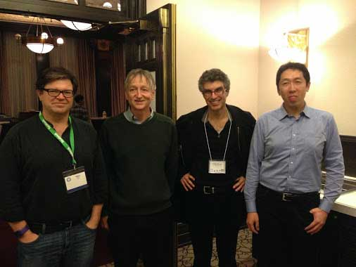
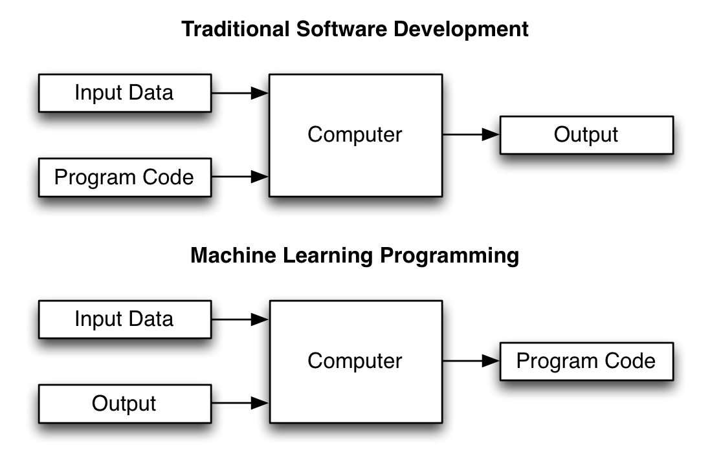
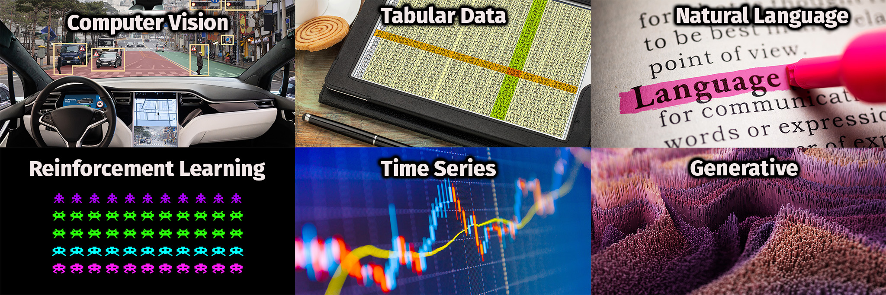

# T81-558: 深度神经网络应用

#### 模块1：Python 基础知识预备

- 讲师：[Jeff Heaton](https://sites.wustl.edu/jeffheaton/)，[圣路易斯华盛顿大学](https://engineering.wustl.edu/Programs/Pages/default.aspx)麦凯维工程学院。
- 更多信息，请访问[课程网站](https://sites.wustl.edu/jeffheaton/t81-558/)。

---

## 模块1目录

1. **课程概述 [[Video]](https://www.youtube.com/watch?v=r7eExQWKzdc&list=PLjy4p-07OYzuy_lHcRW8lPTLPTTOmUpmi) [Notebook]
   **
2. Python 介绍 [[Video]](https://www.youtube.com/watch?v=ZAOOinw51no&list=PLjy4p-07OYzuy_lHcRW8lPTLPTTOmUpmi) [Notebook]
3. Python
   列表、字典、集合、JSON [[Video]](https://www.youtube.com/watch?v=5jZWWLO71bE&list=PLjy4p-07OYzuy_lHcRW8lPTLPTTOmUpmi) [Notebook]
4. 文件处理 [[Video]](https://www.youtube.com/watch?v=CPrp1Sm-AhQ&list=PLjy4p-07OYzuy_lHcRW8lPTLPTTOmUpmi) [Notebook]
5. 函数、Lambda 和
   Map/Reduce [[Video]](https://www.youtube.com/watch?v=DEg8a22mtBs&list=PLjy4p-07OYzuy_lHcRW8lPTLPTTOmUpmi) [Notebook]

观看其中一项（或多项）配置 Python 环境

- [M1 Mac 安装 PyTorch](https://www.youtube.com/watch?v=VEDy-c5Sk8Y)

---

## Google CoLab Instructions

以下代码可确保 Google CoLab 正在运行，并在需要时映射 Google Drive。

``` python
try:
    from google.colab import drive
    COLAB = True
    print("Note: using Google CoLab")
except:
    print("Note: not using Google CoLab")
    COLAB = False
```

## 1.1 概述

深度学习是一种新的神经网络技术 [[Cite:lecun2015deep]](https://www.nature.com/articles/nature14539)，
通过使用高级训练技术和神经网络的架构组件，现在可以训练具有更大复杂性的神经网络。
这本书介绍了读者如何使用深度神经网络、正则化单元（ReLU）、卷积神经网络和循环神经网络。
高性能计算（HPC）方面演示了如何利用图形处理单元（GPUs）和网格来充分利用深度学习。深度学习允许模型学习信息层次，类似于人类大脑的功能。
重点主要集中在深度学习的应用，以及一些关于深度学习数学基础的介绍。
读者将使用Python编程语言构建一个深度学习模型，并在几个实际数据集上解释这些网络的结果 [[Cite:lecun2015deep]](https://www.deeplearningbook.org/)。

### 1.1.1 深度学习的起源

神经网络是机器学习的一种早期实例。神经网络早在20世纪40年代就被引入，并在随后的岁月中经历了兴衰。
当前一代的深度学习始于2006年，其中最重要的是对训练算法的改进，由 Geoffrey
Hinton [[Cite:hinton2006fast]](https://www.mitpressjournals.org/doi/abs/10.1162/neco.2006.18.7.1527) 提出。
这种方法最终允许具有许多层的神经网络（深度神经网络）高效地训练。
四位研究者对神经网络研究做出了重要贡献。他们始终推动神经网络研究，无论是在 ups 和 downs 中。这些四位伟大的研究者以图1.LUM的形式展示。

**图1.LUM: 神经网络杰出人物**

<p> </p>

当前 artificial neural network（ANN）研究和最终深度学习的著名研究者，按图中的顺序呈现：

- [Yann LeCun](http://yann.lecun.com/) - Facebook 纽约大学: 卷积神经网络（CNN）在光学字符识别和计算机视觉中的应用。卷积网络的创始人。
- [Geoffrey Hinton](http://www.cs.toronto.edu/~hinton/) - Google 多伦多大学: 神经网络方面的广泛工作。深度学习的创建者和神经网络反向传播的早期适配器/创建者。
- [Yoshua Bengio](http://www.iro.umontreal.ca/~bengioy/yoshua_en/index.html) - Botler AI 蒙特利尔大学:
  对深度学习、神经网络和机器学习进行了广泛的研究。
- [Andrew Ng](http://www.andrewng.org/) - Baidu 斯坦福大学: 对深度学习、神经网络及其在机器人技术中的应用进行了广泛的研究。

Geoffrey Hinton、Yann LeCun 和 Yoshua Bengio
获得了深度学习的最高奖项之一：[Turing Award](https://www.acm.org/media-center/2019/march/turing-award-2018)。

### 1.1.2 什么是深度学习

本书的关注点是深度学习，这是一种流行的机器学习类型，它基于20世纪80年代流行的神经网络。深度学习与原始神经网络之间的差异几乎没有。
我们一直能够创建和计算深度神经网络。深度神经网络只是具有许多层的神经网络，我们能够创建/计算深度神经网络。然而我们缺乏训练它们的有效方法，深度学习提供了训练深度神经网络的有效方法。

如果深度学习是一种机器学习类型，那么我们应思考“机器学习是什么？”如图 2.ML-DEV 所示。

**图2.ML-DEV: 机器学习和传统软件开发之间的区别**

<p> </p>

- 传统软件开发 - 程序员创建程序是为了将输入转换为所需的输出。
- 机器学习 - 程序员创建模型可以学习给定输入以产生所需的输出。

研究人员已将机器学习应用于许多不同的领域。本课程探讨深度神经网络应用的三个特定领域，如图 3.ML-DOM 所示。

**图3.ML-DOV: 机器学习应用**

<p> </p>

- 计算机视觉：使用机器学习来检测视觉数据中的模式。例如，一张图片是猫还是狗。
- 表格数据：几组命名输入值允许神经网络预测另一个命名值，成为输出。例如，我们使用鸢尾花的几种测量来预测物种。这种数据通常被称为表格数据。
- 自然语言处理（NLP）：深度学习 Transformers 彻底改变了 NLP，允许文本序列生成更多文本、图像或分类。
- 强化学习：强化学习训练神经网络选择正在进行的动作，以便算法奖励神经网络以最佳方式完成任务。
- 时间序列：使用机器学习及时检测模式。典型的时间序列应用是金融应用、语音识别，甚至自然语言处理（NLP）。
- 生成模型：神经网络可以学习从输入生成新的原始合成数据。我们将研究 StyleGAN，它学习创建与训练期间看到的图像相似的新图像。

### 1.1.3 回归、分类及其他

机器学习研究从广义的监督学习和无监督学习的角度着眼于问题。当您知道训练集中每个项目的正确结果时，就会发生监督学习。
另一方面，无监督学习利用不知道正确结果的训练集。深度学习支持监督学习和无监督学习；然而，它还增加了强化和对抗性学习。
强化学习教导神经网络根据环境执行操作。对抗性学习让两个神经网络相互对抗，在数据无法提供正确结果时进行学习。
对抗性学习让两个神经网络相互对抗，在数据无法提供正确结果时进行学习。研究人员不断添加新的深度学习训练技术。

机器学习从业者通常将监督学习分为分类和回归, 分类网络可能接受财务数据并将投资风险分类为风险或安全。
同样，回归神经网络输出一个数字，并可能采用相同的数据并返回风险评分。 此外，神经网络可以同时输出多个回归和分类分数。

神经网络最强大的方面之一是神经网络的输入和输出可以有许多不同的类型，例如：

- 图像
- 可以表示文本、音频或其他时间序列的一系列数字
- 回归数
- 分类类别

### 1.1.4 为什么选择深度学习？

对于表格数据，神经网络的表现通常并不比其他模型明显更好，例如：

- 支持向量机（SVM）
- 随机森林（RF）
- 梯度提升机（GBM）

与其他模型一样，神经网络可以执行**分类**和**回归**。 当应用于相对低维的表格数据任务时，深度神经网络不一定比其他模型类型显着提高准确性。
然而，大多数最先进的解决方案都依赖于图像、视频、文本和音频数据的深度神经网络。

## 1.2 Python 深度学习

本书将使用 Python 3.x 编程语言。 Python 作为一种编程语言，对深度学习拥有最广泛的支持。 Python 中两个最流行的深度学习框架是：

- [TensorFlow/Keras](https://www.tensorflow.org/) (Google)
- [PyTorch](https://pytorch.org/) (Facebook)

本书主要关注 PyTorch。 对于许多任务，我们将直接使用 PyTorch。 然而，我们将利用第三方库来完成更高级别的任务，例如强化学习、生成对抗神经网络等。
这些第三方库可能在内部使用 PyTorch 或 Keras。 我选择这些库是基于流行度和应用程序，而不是它们是否使用 PyTorch 还是 Keras。

要成功使用本书，您必须能够编译和执行利用 PyTorch 进行深度学习的 Python 代码。您有两种选择可以实现此目的：

- 安装 Python、PyTorch 和一些 IDE（Jupyter、TensorFlow 等）。
- 在云中使用 Google CoLab，并可免费访问 GPU。
-

以下部分将引导您完成在本地计算机上安装 Python 的过程。
此过程在 Windows、Linux 或 Mac 上基本相同。 有关特定操作系统说明，请参阅本文档前面的 YouTube 教程视频之一。

### 1.2.1 Tokens 和 Keys

您将拥有该课程的多个 Tokens 和 Keys。

- 作业提交 API Keys：您将在上课前通过电子邮件收到 API 密钥；您将使用此键来提交作业。
- Hugging Face Keys：您需要登录 HuggingFace 并获取免费密钥才能下载某些预训练模型。
- OpenAI 密钥：您将获得此密钥来访问 ChatGPT 并完成作业 6。此密钥仅提供给学生。

### 1.2.2 检查你的Python安装

安装 Python 后，您可以使用以下代码来检查您的 Python 和库版本。如果您有 GPU，您还可以检查 Keras 是否识别它。

```python
# What version of Python do you have?
import platform
import sys

import pandas as pd
import sklearn as sk
import torch

has_gpu = torch.cuda.is_available()
has_mps = getattr(torch, 'has_mps', False)
device = "mps" if getattr(torch, 'has_mps', False) else "gpu" if torch.cuda.is_available() else "cpu"

print(f"Python Platform: {platform.platform()}")
print(f"PyTorch Version: {torch.__version__}")
print()
print(f"Python {sys.version}")
print(f"Pandas {pd.__version__}")
print(f"Scikit-Learn {sk.__version__}")
print("GPU is", "available" if has_gpu else "NOT AVAILABLE")
print("MPS (Apple Metal) is", "AVAILABLE" if has_mps else "NOT AVAILABLE")
print(f"Target device is {device}")

```

```
Python Platform: macOS-13.5.2-arm64-arm-64bit
PyTorch Version: 2.0.1

Python 3.9.18 | packaged by conda-forge | (main, Aug 30 2023, 03:53:08) 
[Clang 15.0.7 ]
Pandas 2.1.0
Scikit-Learn 1.3.0
GPU is NOT AVAILABLE
MPS (Apple Metal) is AVAILABLE
Target device is mps

```


